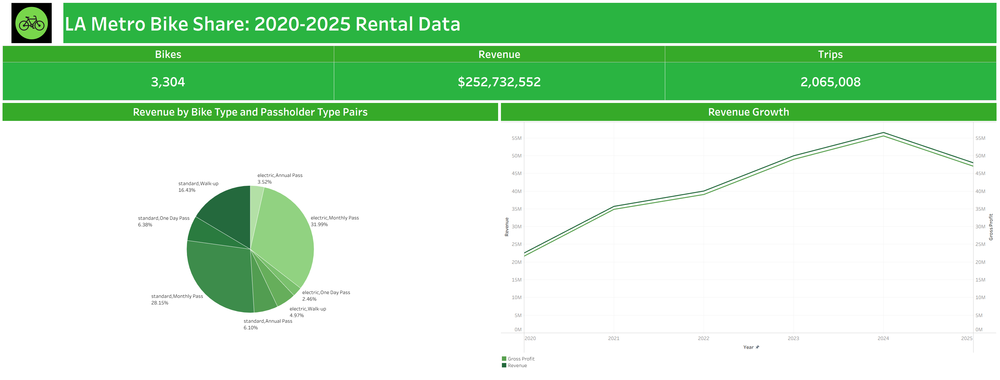

# LA Metro Bike Share Rental Analysis



## Project Overview

This project provides an end-to-end analysis of **LA Metro Bike Share rental data from 2020–2025**, covering more than **2 million trips**.

The project combines **Amazon S3, Amazon Athena, Python, and Tableau** to create a complete data analytics workflow. Raw yearly bike-share data was stored and queried using AWS, cleaned and transformed with SQL and Python, and ultimately visualized through an interactive Tableau dashboard.

The analysis focuses on **rental activity, estimated revenue, bike utilization, passholder behavior, and estimated operating costs**.

The goal of the project is to demonstrate how a large transportation dataset can be transformed into actionable insights through **data cleaning, cloud-based querying, Python automation, calculated metrics, and data visualization**.

---

## Business Objectives

- Analyze **LA Metro Bike Share rental activity from 2020–2025**.
- Measure changes in **estimated rental revenue over time**.
- Compare revenue contribution across **bike types and passholder types**.
- Identify which **bike and passholder combinations** contribute the most estimated revenue.
- Compare **estimated revenue and gross profit** across multiple years.
- Estimate **annual bike maintenance costs** based on the number of unique bikes in operation.
- Build an automated workflow for transforming raw trip data into **analysis-ready datasets**.
- Present key findings through an **interactive Tableau dashboard**.

---

## Key Insights

- The processed dataset contains **2,065,008 bike-share trips** from 2020–2025.
- A total of **3,304 unique bikes** are represented in the dashboard.
- The project's revenue model estimates approximately **$252.7 million in rental revenue** across the analyzed period.
- **Electric Bike + Monthly Pass** riders represent the largest revenue segment, accounting for approximately **31.99%** of estimated revenue.
- **Standard Bike + Monthly Pass** riders are the second-largest segment, contributing approximately **28.15%**.
- Together, the two Monthly Pass segments account for approximately **60% of estimated revenue**.
- Estimated annual revenue generally increased from **2020 through 2024**, reaching its highest level in 2024 before declining in 2025.
- Estimated gross profit closely follows estimated revenue because maintenance costs represent a relatively small portion of the project's modeled costs.

> **Note:** Revenue and gross profit figures shown in this project are analytical estimates derived from the available trip data and assumptions used in the project. They should not be interpreted as LA Metro's official reported financial results.

---

## Data Pipeline

The project follows an end-to-end analytics pipeline:

**LA Metro Bike Share Data → Amazon S3 → Amazon Athena → Python → Amazon S3 → Tableau**

### 1. Data Collection

Quarterly trip datasets were obtained from the **LA Metro Bike Share website** for the years **2020–2025**.

### 2. Cloud Storage

The datasets were stored in **Amazon S3**, providing centralized cloud storage for the project data.

### 3. SQL Processing with Amazon Athena

**Amazon Athena** was used to query the data stored in S3.

SQL was used to:

- Combine yearly trip data into a unified dataset.
- Perform initial data cleaning.
- Prepare the data for additional processing in Python.

### 4. Python Data Processing

Python was used for additional cleaning, transformation, and feature engineering.

The Python pipeline:

- Imports query results from Amazon S3.
- Removes records that were not needed for the final analysis.
- Removes records with missing passholder information.
- Calculates **estimated revenue** using trip duration and passholder type.
- Incorporates additional charges associated with electric-bike trips into the revenue model.
- Creates a combined **bike type/passholder type** field for analysis.
- Calculates estimated yearly bike maintenance costs.
- Exports the processed datasets back to Amazon S3.

### 5. Tableau Visualization

The final processed data was connected to **Tableau Desktop** to build an interactive dashboard summarizing rental activity, estimated revenue, gross profit, and customer segments.

---

## Technical Details

| **Aspect** | **Details** |
|---|---|
| **Tools Used** | Python, Pandas, NumPy, Tableau Desktop, Amazon S3, Amazon Athena, SQL |
| **Cloud Platform** | Amazon Web Services (AWS) |
| **Data Source** | LA Metro Bike Share public trip data |
| **Analysis Period** | 2020–2025 |
| **Processed Trips** | 2,065,008 |
| **Unique Bikes** | 3,304 |
| **Estimated Revenue** | $252,732,552 |
| **Python Libraries** | Pandas, NumPy, boto3 |
| **Storage** | Amazon S3 |
| **SQL Query Engine** | Amazon Athena |
| **Visualization Tool** | Tableau Desktop |
| **Visual Types** | KPI Cards, Pie Chart, Time-Series Line Chart |
| **Purpose** | Analyze bike-share usage and estimated financial performance while demonstrating an end-to-end cloud data analytics workflow |

---

## Key Metrics Visualized

- **Total Unique Bikes**
- **Total Trips**
- **Total Estimated Revenue**
- **Estimated Revenue by Year**
- **Estimated Gross Profit by Year**
- **Revenue Growth from 2020–2025**
- **Revenue by Bike Type**
- **Revenue by Passholder Type**
- **Revenue by Bike Type + Passholder Type Combination**

---

## Revenue & Cost Modeling

Because the source trip dataset does not directly provide complete transaction-level revenue, this project creates an **estimated revenue model** based on trip characteristics and pricing assumptions.

Revenue calculations incorporate:

- Trip duration
- Passholder type
- Bike type
- Additional modeled electric-bike charges

The project also estimates annual maintenance expenses using:

**Estimated Annual Maintenance Cost = Number of Unique Bikes × $500**

These calculated values are used for analytical purposes and allow estimated revenue, costs, and gross profit to be compared across years.

They are **not official LA Metro financial figures**.

---

## Business Impact

This analysis demonstrates how bike-share trip data can be transformed into information that could support transportation and operational analysis.

The dashboard can be used to:

- Monitor **rental and revenue trends over time**.
- Identify **high-value rider and bike segments**.
- Compare the contribution of different **passholder types**.
- Examine the role of **standard and electric bikes** in estimated revenue.
- Evaluate estimated **maintenance expenses relative to rental revenue**.
- Identify changes in bike-share activity that may warrant further investigation.
- Support **data-driven operational and financial analysis**.

---

## Data Source

**Dataset:** LA Metro Bike Share Trip Data  
**Source:** LA Metro Bike Share  
**Period Analyzed:** 2020–2025  
**Format:** Quarterly CSV files

LA Metro Bike Share publishes anonymized trip-level datasets containing fields such as trip duration, bike ID, route category, passholder type, and bike type.

The original datasets were combined, cleaned, transformed, and modeled using **Amazon Athena and Python** before visualization in Tableau.

---

## Project Structure

```text
la-metro-bike-share-analysis/
│
├── images/
│   └── Dashboard.png
│
├── src/
│   ├── main.py
│   ├── process.py
│   ├── s3_import.py
│   ├── export_to_s3.py
│   ├── maintenance_costs.py
│   ├── to_python.csv
│   ├── final.csv
│   └── maintenance_costs.csv
│
└── README.md
